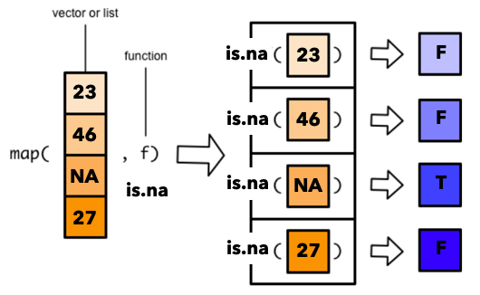

```{r xaringanExtra, echo=FALSE}
xaringanExtra::use_xaringan_extra(c("tile_view","broadcast"))
```

```{r xaringan-themer, include=FALSE, warning=FALSE}
# Set up custom theme
library(xaringanthemer)
library(tidyverse)
style_mono_accent(
  base_color = "#1c5253",
  header_font_google = google_font("Josefin Sans"),
  text_font_google   = google_font("Montserrat", "300", "300i"),
  code_font_google   = google_font("Fira Mono"),
  base_font_size = "20px",
  text_font_size = "1.5rem",
  header_h1_font_size = "3rem",
  header_h2_font_size = "2.5rem",
  header_h3_font_size = "2rem",
)
```

```{r, include = F}
knitr::opts_chunk$set(fig.width = 6, message = FALSE, warning = FALSE, comment = "", cache = F)
library(flipbookr)
library(icons) #https://fontawesome.com/v5.15/icons?d=gallery&p=2&m=free
```

# Types of automation
- Replacing manual copy/paste/renaming with data-cleaning scripts
- Replacing drop-down menu analyses with scripts
--

- **Replacing repetitive code with more efficient code**

```{r, eval=F} 
# Tedious thing 1
summarize(m_a = mean(a), m_b = mean(b), m_c = mean(c), m_d = mean(d))

# Tedious thing 2
ds_a <- read_csv(“data_a.csv”)
ds_b <- read_csv(“data_b.csv”)
ds_c <- read_csv(“data_b.csv”) #oops
```

---
# Today's tutorial

- Ways to make coding more efficient
  * Defining reusable functions
  * Mutating and summarizing *across* columns
  * Repeating operations using for loops
  * Repeating operations using *map*
 
.content-box-blue[
`r icons::fontawesome("github")` Follow along from the [Github repo](https://github.com/psych-259-data-science-2022/259-automation)
]

.footnote[.small[.bold[Last updated: `r Sys.Date()`]]]

---
# Functions extend and customize a programming language

- R packages aren't anything more than sets of functions that you load using `library()`
- CRAN is a centralized repository of vetted R packages for thousands of different purposes
  * `install.packages()` installs packages that are hosted on CRAN
- You can also download experimental packages or newer versions from Github
  * `devtools` lets you install directly from Github links
- You can also write your own functions that you load for a project to make repetitive operations easier

---
# Defining a function

- A function is assigned just like any other variable and will appear in the environment
- Input *arguments* go in parentheses, and the function body is contained in curly brackets
- The function returns the last computed value or the value listed by the `return()` function
- Be sure to highlight and run the entire function to assign it

```{r}
hyp <- function(side_a, side_b) {
  a <- side_a^2
  b <- side_b^2
  h <- sqrt(a + b)
  return(h)
}
hyp(3, 4)
hyp(9, 12)
```
---
# Function arguments

- Functions can have any number of arguments
- To make arguments optional, give a default value
- `NULL` can be a useful default option 
```{r}
hyp <- function(side_a, side_b = NULL) {
  a <- side_a^2
  b <- ifelse(is.null(side_b), a, side_b^2)
  h <- sqrt(a + b)
  return(h)
}
hyp(9, 9)
hyp(9)
```
---
# Function arguments

```{r}
hyp <- function(side_a, side_b) {
  #Functions don't ensure the type of arguments
  if (is.numeric(side_a) & is.numeric(side_b)) {
      a <- side_a^2
      b <- ifelse(is.null(side_b), a, side_b^2)
      h <- sqrt(a + b)
      return(h)
  } else {
    return("Both sides must be numeric values")
  }
}
hyp(9, 9)
hyp("9", "8")
```
---
# Control program flow with `if` and `else` statements

```{r}
x <- 1
if (x == 0) {
  paste(x, "is exactly 0")
} else if (x < 0) {
  paste(x, "is negative")
} else {
  paste(x, "is positive")
} 
```

---
# Control program flow with `if` and `else` statements

```{r}
x <- -1
if (x == 0) {
  paste(x, "is exactly 0")
} else if (x < 0) {
  paste(x, "is negative")
} else {
  paste(x, "is positive")
} 
```
---
# Write "wrapper functions" to make your life easier

```{r}
mean_na <- function(x) mean(x, na.rm = T)
sd_na <- function(x) sd(x, na.rm = T)
se_na <- function(x) {
  x <- discard(x, is.na) #discard is like "filter if not" for vectors
  sd(x)/sqrt(length(x))
}
```
- Note, one-line functions don't need curly brackets

---
# Use lists to return multiple outputs

```{r}
summary_stats_na <- function(x) {
  # Functions can call previously defined functions
  list(mean = mean_na(x), sd = sd_na(x), se = se_na(x))
}
data <- c(4, 6, 9, 12, 5, 6, NA)
summary_stats_na(data)
```

---
# Piped expressions can be saved as functions

```{r}
avg_height_mass <- . %>% 
  select(height, mass) %>% 
  summarize(mean_ht = mean_na(height), mean_ms = mean_na(mass))

starwars %>% avg_height_mass
starwars %>% group_by(species) %>% avg_height_mass
```

---
# Advantages of functions

- Save typing, make code more readable

- Encapsulate computations
  * Note that *internal* intermediate variables don't appear in your environment
  * Functions in R can access variables in the global environment even if they are not passed as arguments
  
- Introduce abstraction
  * Breaks up your code into conceptual chunks
  * Increases the possibility of reuse (and spend more time debugging things that will be reused)

---
# Some types of automation are built-in
- *Vectorized* operations (like adding values between two columns) operate on every element simultaneously (you don't have to perform the operation on every row)

- `rename_all()`, `rename_with()` and `make_clean_names()` operate on multiple columns

- `mutate()` and `summarize()` can operate on selections of columns with `across()`
  * `across(selection_statement, fx_to_apply)`

---
`r chunk_reveal("mutate_across", break_type = "rotate", float = "none", widths = c(12, 1), title = "# Mutate across()")`

```{r mutate_across, include = FALSE}
ds <- starwars %>% select(-where(is.list))
ds #ROTATE
ds %>% mutate(across(everything(), as.character)) #ROTATE
ds %>% mutate(across(c("height", "mass"), round)) #ROTATE
ds %>% mutate(across(where(is.numeric), round)) #ROTATE
ds %>% mutate(across(where(is.numeric), round, .names = "{.col}_rounded")) #ROTATE
ds %>% mutate(across(where(is.numeric), ~ .x *100)) #ROTATE
ds %>% mutate(across(ends_with("color"), ~ str_remove_all(.x, "[:punct:]"))) #ROTATE
```
---
# Across() relies on "in-line" functions

- `~ round(.x)` is a shortcut for:
```{r}
round_x <- function(x) round(x)
```
- in-line functions use `.x` as the argument

---
`r chunk_reveal("summarize_across", break_type = "rotate", float = "none", widths = c(12, 1), title = "# Summarize across()")`

```{r summarize_across, include = FALSE}
ds <- starwars %>% select(-where(is.list))
fx_list <- list(mean = mean_na, sd = sd_na, se = se_na)
ds %>% summarize(across(height:mass, mean, na.rm = T)) #ROTATE
ds %>% summarize(across(height:mass, ~ mean(.x, na.rm = T))) #ROTATE
ds %>% summarize(across(height:mass, mean_na)) #ROTATE
ds %>% summarize(across(where(is.numeric), fx_list)) #ROTATE
ds %>% summarize(across(where(is.numeric), fx_list, .names = "{.fn}-{.col}")) #ROTATE
```
---
# Make a summary stats function
```{r}
summary_stats <- function(df, var_select_string) {
  na_mean <- function(x) mean(x, na.rm = T)
  na_sd <- function(x) sd(x, na.rm = T)
  fx_list <- list(M = na_mean, SD = na_sd)
  df  %>% summarize(across(contains(var_select_string) & where(is.numeric), fx_list))
}
ds %>% summary_stats("height")
ds %>% group_by(species) %>% filter(n() > 1) %>% summary_stats(c("height","mass"))
```

---

# Iteration

- Run the same series of computations on each element of a vector or list, one at a time
- A "for loop" is constructed in a similar way to a function or if-else statement
```{r}
for (i in c(1, 2, 3, 4, 5)) {
  # "i" will take on each value of the vector 1:5
  print(paste("This is loop iteration", i))
}
```

---
# For loops

- The vector to iterate over doesn't need to be numeric or sequential:

```{r}
days_of_the_week <- c("Tues", "Wed", "Mon", "Thur", "Sun", "Fri" )

for (i in days_of_the_week) {
  print(paste("Today is", i))
}
```

---
# Use for loops to run a series of analyses
```{r}
mtcars #built-in R dataset
```

---
# Use for loops to run a series of analyses
```{r}
preds <- c("cyl", "disp", "hp", "drat", "wt", "qsec")
cor_output <- vector() #empty vector to store results
for (p in preds) {
  #Calculate each predictor's correlation with 'mpg'
  cor_output[p] <- cor(mtcars['mpg'], mtcars[p])
}
cor_output
```

---
# Use for loops to run a series of analyses
```{r}
# Simple linear regression
lm(mpg ~ cyl, data = mtcars)
```

---
# Use for loops to run a series of analyses
```{r}
preds <- c("cyl", "disp", "hp", "drat", "wt", "qsec")
for (p in preds) {
  f <- as.formula(paste("mpg ~ ", p)) # Convert a string to a formula
  res <- lm(f, data = mtcars)
  print(p) #Need to explicitly print things within loops so that they display
  print(summary(res))
}
```

---
# Map a function to each element of a vector/list

.center[]

---
# Map a function to each element of a vector/list
```{r}
days_of_the_week <- c("Mon", "Tues", "Wed", "Thur", "Fri", "Sat", "Sun")
map(days_of_the_week, toupper) #Default output is a list
```
---
# Map a function to each element of a vector/list
```{r}
days_of_the_week <- c("Mon", "Tues", "Wed", "Thur", "Fri", "Sat", "Sun")
map_chr(days_of_the_week, toupper) #Use map_* to specify the output type
map_chr(days_of_the_week, ~ paste("Day: ", .x)) #Use in-line fns like in across()
map_lgl(days_of_the_week, ~ str_detect(.x, "M"))
```

---
# Use map to run a series of analyses
```{r}
preds <- c("cyl", "disp", "hp", "drat", "wt", "qsec")
cor_output <- map(preds, ~ cor(mtcars['mpg'], mtcars[.x]))
cor_output
```

---
# Use map to run a series of analyses
```{r}
preds <- c("cyl", "disp", "hp", "drat", "wt", "qsec")
cor_output <- map_dbl(preds, ~ cor(mtcars['mpg'], mtcars[.x]))
cor_output
# Use set_names to make mapped outputs more readable
cor_output %>% set_names(preds)
```

---
# Use map to run a series of analyses
```{r}
preds <- c("cyl", "disp", "hp", "drat", "wt", "qsec")
output <- map(preds, ~ lm(as.formula(paste("mpg ~ ", .x)), data = mtcars))
output %>% set_names(preds)
```

---
# Other considerations

- If you're new to loops/mapping, don't try to write the whole thing at once

- First write the single element/single case computation, and then edit it to work over a loop/map

- Writing a function makes map or across a lot easier to use (no need for in-line functions)

- Splitting is a nice way to create a list of filtered data frames to feed into map

---
# Use map to run a series of analyses
```{r}
preds <- c("cyl", "disp", "hp", "drat", "wt", "qsec")
mpg_lm <- function(p) {
  f <- as.formula(paste("mpg ~ ", p))
  res <- lm(f, data = mtcars)
  res$call <- f
  return(res)
}
results <- map(preds, mpg_lm)
map(results, summary)
```

---
# What if we wanted all combinations?
```{r}
preds <- c("cyl", "disp", "hp", "drat", "wt", "qsec")
all_combos <- expand.grid(preds, preds) %>% filter(Var1 != Var2)
all_combos
```

---
# Use map to run a series of analyses
```{r}
# Revise fx to take two inputs
mpg_lm <- function(criterion, predictor) {
  f <- as.formula(paste(criterion,"~",predictor))
  res <- lm(f, data = mtcars)
  res$call <- f
  return(res)
}
# Use map2 to provide two inputs
results <- map2(all_combos$Var1, all_combos$Var2, mpg_lm)
map(results, summary)
```


---
# Use map on a split data frame
```{r}
ds <- mtcars %>% mutate(trans = factor(am, labels = c("auto","manual")))
df_split <- ds %>% group_by(trans) %>% group_split %>% set_names(levels(ds$trans))
results <- map(df_split, ~ lm(mpg ~ hp, data = .x))
map(results, summary)
```
<!-- adjust font size and other formatting defs in this css code chunk -->
```{css, eval = TRUE, echo = FALSE}
.remark-code{line-height: 1.1; font-size: 65%}

@media print {
  .has-continuation {
    display: block;
  }
}

code.r.hljs.remark-code{
  position: relative;
  overflow-x: hidden;
}

.remark-slide-number {
  opacity: 0; /* default: 0.5 */
}

.content-box { 
    box-sizing: border-box;
    background-color: #e2e2e2;
}
.content-box-blue,
.content-box-gray,
.content-box-grey,
.content-box-army,
.content-box-green,
.content-box-purple,
.content-box-red,
.content-box-yellow {
  box-sizing: border-box;
  border-radius: 15px;
  margin: 0 0 15px;
  overflow: hidden;
  padding: 0px 20px 0px 20px;
  width: 100%;
}
.content-box-blue { background-color: #F0F8FF; }
.content-box-gray { background-color: #e2e2e2; }
.content-box-grey {	background-color: #F5F5F5; }
.content-box-army {	background-color: #737a36; }
.content-box-green { background-color: #d9edc2; }
.content-box-purple { background-color: #e2e2f9; }
.content-box-red { background-color: #ffcccc; }
.content-box-yellow { background-color: #fef5c4; }
.content-box-blue .remark-inline-code,
.content-box-blue .remark-inline-code,
.content-box-gray .remark-inline-code,
.content-box-grey .remark-inline-code,
.content-box-army .remark-inline-code,
.content-box-green .remark-inline-code,
.content-box-purple .remark-inline-code,
.content-box-red .remark-inline-code,
.content-box-yellow .remark-inline-code { 
  background: none;
}

.scroll-box-8 {
  height:8em;
  overflow-y: scroll;
}
.scroll-box-10 {
  height:10em;
  overflow-y: scroll;
}
.scroll-box-12 {
  height:12em;
  overflow-y: scroll;
}
.scroll-box-14 {
  height:14em;
  overflow-y: scroll;
}
.scroll-box-16 {
  height:16em;
  overflow-y: scroll;
}
.scroll-box-18 {
  height:18em;
  overflow-y: scroll;
}
.scroll-box-20 {
  height:20em;
  overflow-y: scroll;
}
.scroll-output {
  height: 90%;
  overflow-y: scroll;
}
}

/************************
 * Font size and colours
 ************************/

/*      LaTeX style       */
.Large       , .Large .remark-code, .Large .remark-inline-code { font-size: 144%; }
.large       , .large .remark-code, .large .remark-inline-code { font-size: 120%; }
.small       , .small .remark-code, .small .remark-inline-code { font-size: 90%; }
.footnotesize, .footnotesize .remark-code, .footnotesize .remark-inline-code { font-size: 80%; }
.scriptsize  , .scriptsize .remark-code, .scriptsize .remark-inline-code { font-size: 70%; }
.tiny        , .tiny .remark-code, .tiny .remark-inline-code { font-size: 60%; }

/* or you can be more specific */
.font10 , .code10 .remark-code, .code10 .remark-inline-code{ font-size: 10%; }
.font20 , .code20 .remark-code, .code20 .remark-inline-code{ font-size: 20%; }
.font30 , .code30 .remark-code, .code30 .remark-inline-code{ font-size: 30%; }
.font40 , .code40 .remark-code, .code40 .remark-inline-code{ font-size: 40%; }
.font50 , .code50 .remark-code, .code50 .remark-inline-code{ font-size: 50%; }
.font60 , .code60 .remark-code, .code60 .remark-inline-code{ font-size: 60%; }
.font70 , .code70 .remark-code, .code70 .remark-inline-code{ font-size: 70%; }
.font75 , .code75 .remark-code, .code75 .remark-inline-code{ font-size: 75%; }
.font80 , .code80 .remark-code, .code80 .remark-inline-code{ font-size: 80%; }
.font90 , .code90 .remark-code, .code90 .remark-inline-code{ font-size: 90%; }
.font100, .code100 .remark-code, .code100 .remark-inline-code{ font-size: 100%; }
.font110, .code110 .remark-code, .code110 .remark-inline-code{ font-size: 110%; }
.font120, .code120 .remark-code, .code120 .remark-inline-code{ font-size: 120%; }
.font130, .code130 .remark-code, .code130 .remark-inline-code{ font-size: 130%; }
.font140, .code140 .remark-code, .code140 .remark-inline-code{ font-size: 140%; }
.font150, .code150 .remark-code, .code150 .remark-inline-code{ font-size: 150%; }
.font160, .code160 .remark-code, .code160 .remark-inline-code{ font-size: 160%; }
.font170, .code170 .remark-code, .code170 .remark-inline-code{ font-size: 170%; }
.font175, .code175 .remark-code, .code175 .remark-inline-code{ font-size: 175%; }
.font180, .code180 .remark-code, .code180 .remark-inline-code{ font-size: 180%; }
.font190, .code190 .remark-code, .code190 .remark-inline-code{ font-size: 190%; }
.font200, .code200 .remark-code, .code200 .remark-inline-code{ font-size: 200%; }

.brand-red { color: #e64626; }
.brand-blue { color: #0148A4; }
.brand-yellow { color: #FFB800; }
.brand-charcoal {color: #424242; }
.brand-gray {color: #F1F1F1;}
.brand-grey {color: #F1F1F1;}
.black { color: black; }
.white { color: white; }
.red { color: red; }
.blue { color: blue; }
.green { color: green; }
.yellow { color: yellow; }
.orange { color: orange; }
.purple { color: purple; }
.gray { color: gray; }
.grey { color: gray; }

.bold { font-weight: bold; }
.bolder { font-weight: bolder; }
```

