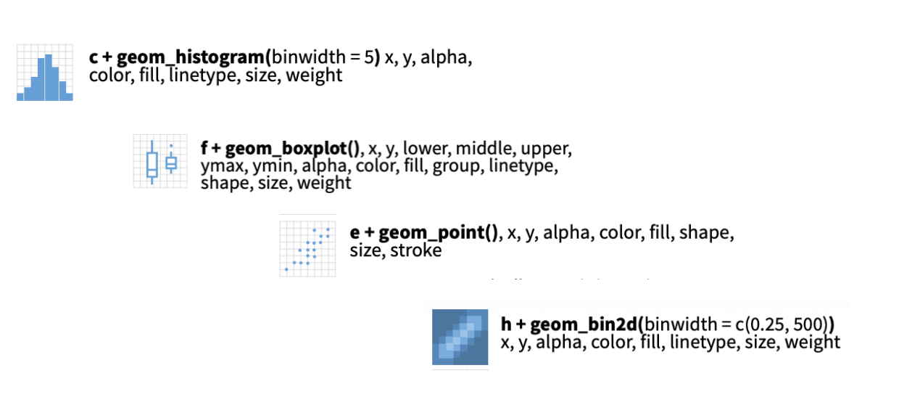
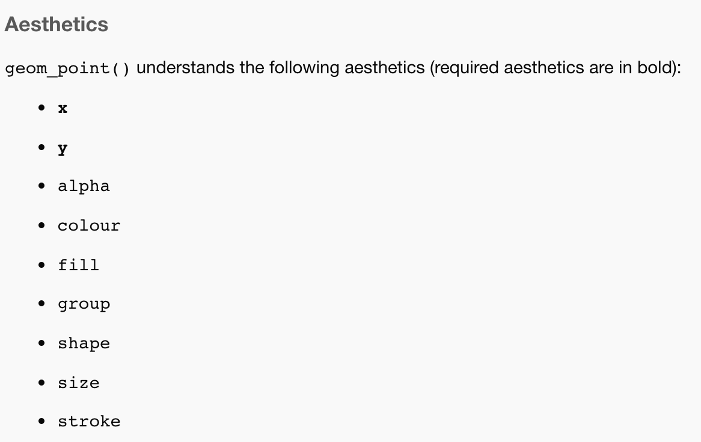

```{r xaringanExtra, echo=FALSE}
xaringanExtra::use_xaringan_extra(c("tile_view","broadcast"))
```

```{r xaringan-themer, include=FALSE, warning=FALSE}
# Set up custom theme
library(xaringanthemer)
style_mono_accent(
  base_color = "#1c5253",
  header_font_google = google_font("Josefin Sans"),
  text_font_google   = google_font("Montserrat", "300", "300i"),
  code_font_google   = google_font("Fira Mono"),
  base_font_size = "20px",
  text_font_size = "1.5rem",
  header_h1_font_size = "3rem",
  header_h2_font_size = "2.5rem",
  header_h3_font_size = "2rem",
)
```

```{r, include = F}
knitr::opts_chunk$set(fig.width = 6, message = FALSE, warning = FALSE, comment = "", cache = F)
library(flipbookr)
library(icons)
library(tidyverse)
library(DataExplorer)
library(here)
```

```{r, include = F}
# Set up the file we'll be using
ds <- read_csv("data-raw/raw_data.csv")
demo <- readxl::read_excel("data-raw/participant_demo.xlsx", sheet = "Data") %>% rename_all(janitor::make_clean_names)
ds <- ds %>% pivot_longer(-id, names_to = "variable", values_to = "value") %>% 
  mutate(condition = ifelse(str_detect(variable, "walk"), "walk", "search"),
         variable = str_remove_all(variable, "walk_"),
         variable = str_remove_all(variable, "search_"))
ds <- ds %>% pivot_wider(id_cols = c("id", "condition"), names_from = "variable", values_from = "value")
ds <- left_join(ds, demo, by = c("id" = "subject_number"))
ds <- ds %>% relocate(test_date:humidity, .after = condition)
```

# CDA vs. EDA

- Goals of Confirmatory Data Analysis
  * Hypothesis testing, probabilistic modeling, inference
- Goals of Exploratory Data Analysis (Tukey)
  * Understanding the patterns in the data
  * Generating hypotheses
  * Checking your assumptions about data quality
  * “To find the unexpected, to avoid being fooled, and to develop rich descriptions” (Behrens & Yu, 2003)

---
# Why do we need EDA? 
- Summarizing = a loss of information
  * If you first look at summarized data (across trials, across participants, etc.), you may miss important patterns that exist at the raw data level
- Statistics lie, so you need graphics
  * Correlations without looking at the scatterplot
  * Means without examining outliers/distribution
  * Statistical tests without checking *N*

.footnote[.small[.bold[[Behrens & Yu, 2013](https://psycnet.apa.org/record/2012-27075-002)]]]

---
# Today's tutorial

- Ways to explore and check data
  * `dplyr` functions like `filter()`, `summarize()`, and `count()`
  * Specialized packages: `DataExplorer`
  * Plotting distributions using `ggplot2`
 
.content-box-blue[
`r icons::fontawesome("github")` Follow along from the [Github repo](https://github.com/psych-259-data-science-2022/259-exploratory-data-analaysis)
]

.footnote[.small[.bold[Last updated: `r Sys.Date()`]]]

---
# Example data for today
```{r}
glimpse(ds)
```

---
# Things we already know how to do
```{r}
# Filter based on expected ranges
ds %>% select(id, age) %>% filter(age < 18 | age > 22)
# Filter based a set of possible values
ds %>% select(id, handedness) %>% filter(!(handedness %in% c("Right", "Left")))
```
---
# Things we already know how to do
```{r}
# Get summary stats
ds %>% summarize(age_min = min(age), mean_age = mean(age), max_age = max(age))
ds %>% drop_na(age) %>% summarize(age_min = min(age), mean_age = mean(age), max_age = max(age))
summary(ds$age) #Also a nice option
```
---
# Things we already know how to do
```{r}
# Check the number of participant ids
length(unique(ds$id)) # Should be 30
# Count
count(ds, sex)
```

---
# Other ways to explore data

- `DataExplorer` package
  * Quickly generate EDA plots for every column in your dataset
  * `plot_histogram` and `plot_density` for continuous variables
  * `plot_bar` for categorical
  * `plot_boxplot` for detecting outliers
  * `plot_missing` for missingness
  * `plot_correlation` for between-column correlations at a glance
  * `create_report` for everything
- What it's not for: making publication-ready plots

---
## Data Explorer: Histograms
```{r}
ds %>% select(condition, gazex_std:posy_speed) %>% plot_histogram()
```

---
## Data Explorer: Density plots
```{r}
ds %>% select(condition, gazex_std:posy_speed) %>% plot_density()
```

---
## Data Explorer: Boxplots by condition
```{r}
ds %>% select(condition, gazex_std:posy_speed) %>% plot_boxplot(by = "condition")
```

---
## Data Explorer: Plot missing
```{r}
ds %>% select(id:humidity) %>% plot_missing()
```

---
## Data Explorer: Correlations
```{r}
ds %>% select(condition, gazex_std:posy_speed) %>% plot_correlation()
```

---
## Data Explorer: Create Report

- `create_report()` is a brute force approach, which makes every imaginable plot
- Usually better to narrow in to make sure that you're scanning plots that make sense

```{r, eval = F}
ds %>% create_report()
# Saves an html report to your working directory
```

---
# Other option: Make your own plots

- Introducing the `ggplot2` package
- Parts of a ggplot call:
```{r, eval = F}
# Parts of a ggplot call
ggplot(DATASET, aes(MAPPING STATEMENT)) + 
  geom_TYPE() + 
  geom_TYPE() + 
  ETC... + 
  OTHER_FORMATTING() #axes, labels, legends, themes, etc.
```
- Note that ggplot uses `+`, not `%>%`

---
# What type of aesthetic mapping depends on what type of geom

.center[]

---
# What type of aesthetic mapping depends on what type of geom
- `?geom_point` and scroll down to find required aesthetics in bold
.center[]

---
`r chunk_reveal("geoms", break_type = "rotate", widths = c(1, 1), title = "Single-aesthetic plots")`

```{r geoms, include = FALSE}
ggplot(ds, aes(x = posy_std)) + 
  geom_histogram() + #ROTATE
  geom_density() + #ROTATE
  geom_boxplot() + #ROTATE
  xlab("Average vertical head position")
```

---
`r chunk_reveal("categorical", float = "none", break_type = "rotate", widths = c(2, 1), title = "Add a category")`

```{r categorical, include = FALSE}
ggplot(ds) + 
 geom_boxplot(aes(y = posy_std)) + #ROTATE 
 geom_boxplot(aes(x = condition, y = posy_std)) + #ROTATE
 geom_boxplot(aes(x = condition, y = posy_std, fill = condition)) + #ROTATE
 geom_boxplot(aes(x = condition, y = posy_std, fill = target)) #ROTATE
```

---
`r chunk_reveal("scatterplot", break_type = "auto", widths = c(1, 1), title = "Simple scatterplot")`

```{r scatterplot, include = FALSE}
ggplot(ds, aes(x = posx_mean, y = posy_mean)) + 
  geom_point() + 
  xlim(-20, 20) + 
  ylim(-20, 20) + 
  xlab("Mean horizontal head position") + 
  ylab("Mean vertical head position") +
  geom_vline(xintercept = 0) + 
  geom_hline(yintercept = 0)
```


<!-- adjust font size and other formatting defs in this css code chunk -->
```{css, eval = TRUE, echo = FALSE}
.remark-code{line-height: 1.1; font-size: 65%}

@media print {
  .has-continuation {
    display: block;
  }
}

code.r.hljs.remark-code{
  position: relative;
  overflow-x: hidden;
}

.remark-slide-number {
  opacity: 0; /* default: 0.5 */
}

.content-box { 
    box-sizing: border-box;
    background-color: #e2e2e2;
}
.content-box-blue,
.content-box-gray,
.content-box-grey,
.content-box-army,
.content-box-green,
.content-box-purple,
.content-box-red,
.content-box-yellow {
  box-sizing: border-box;
  border-radius: 15px;
  margin: 0 0 15px;
  overflow: hidden;
  padding: 0px 20px 0px 20px;
  width: 100%;
}
.content-box-blue { background-color: #F0F8FF; }
.content-box-gray { background-color: #e2e2e2; }
.content-box-grey {	background-color: #F5F5F5; }
.content-box-army {	background-color: #737a36; }
.content-box-green { background-color: #d9edc2; }
.content-box-purple { background-color: #e2e2f9; }
.content-box-red { background-color: #ffcccc; }
.content-box-yellow { background-color: #fef5c4; }
.content-box-blue .remark-inline-code,
.content-box-blue .remark-inline-code,
.content-box-gray .remark-inline-code,
.content-box-grey .remark-inline-code,
.content-box-army .remark-inline-code,
.content-box-green .remark-inline-code,
.content-box-purple .remark-inline-code,
.content-box-red .remark-inline-code,
.content-box-yellow .remark-inline-code { 
  background: none;
}

.scroll-box-8 {
  height:8em;
  overflow-y: scroll;
}
.scroll-box-10 {
  height:10em;
  overflow-y: scroll;
}
.scroll-box-12 {
  height:12em;
  overflow-y: scroll;
}
.scroll-box-14 {
  height:14em;
  overflow-y: scroll;
}
.scroll-box-16 {
  height:16em;
  overflow-y: scroll;
}
.scroll-box-18 {
  height:18em;
  overflow-y: scroll;
}
.scroll-box-20 {
  height:20em;
  overflow-y: scroll;
}
.scroll-output {
  height: 90%;
  overflow-y: scroll;
}
}

/************************
 * Font size and colours
 ************************/

/*      LaTeX style       */
.Large       , .Large .remark-code, .Large .remark-inline-code { font-size: 144%; }
.large       , .large .remark-code, .large .remark-inline-code { font-size: 120%; }
.small       , .small .remark-code, .small .remark-inline-code { font-size: 90%; }
.footnotesize, .footnotesize .remark-code, .footnotesize .remark-inline-code { font-size: 80%; }
.scriptsize  , .scriptsize .remark-code, .scriptsize .remark-inline-code { font-size: 70%; }
.tiny        , .tiny .remark-code, .tiny .remark-inline-code { font-size: 60%; }

/* or you can be more specific */
.font10 , .code10 .remark-code, .code10 .remark-inline-code{ font-size: 10%; }
.font20 , .code20 .remark-code, .code20 .remark-inline-code{ font-size: 20%; }
.font30 , .code30 .remark-code, .code30 .remark-inline-code{ font-size: 30%; }
.font40 , .code40 .remark-code, .code40 .remark-inline-code{ font-size: 40%; }
.font50 , .code50 .remark-code, .code50 .remark-inline-code{ font-size: 50%; }
.font60 , .code60 .remark-code, .code60 .remark-inline-code{ font-size: 60%; }
.font70 , .code70 .remark-code, .code70 .remark-inline-code{ font-size: 70%; }
.font75 , .code75 .remark-code, .code75 .remark-inline-code{ font-size: 75%; }
.font80 , .code80 .remark-code, .code80 .remark-inline-code{ font-size: 80%; }
.font90 , .code90 .remark-code, .code90 .remark-inline-code{ font-size: 90%; }
.font100, .code100 .remark-code, .code100 .remark-inline-code{ font-size: 100%; }
.font110, .code110 .remark-code, .code110 .remark-inline-code{ font-size: 110%; }
.font120, .code120 .remark-code, .code120 .remark-inline-code{ font-size: 120%; }
.font130, .code130 .remark-code, .code130 .remark-inline-code{ font-size: 130%; }
.font140, .code140 .remark-code, .code140 .remark-inline-code{ font-size: 140%; }
.font150, .code150 .remark-code, .code150 .remark-inline-code{ font-size: 150%; }
.font160, .code160 .remark-code, .code160 .remark-inline-code{ font-size: 160%; }
.font170, .code170 .remark-code, .code170 .remark-inline-code{ font-size: 170%; }
.font175, .code175 .remark-code, .code175 .remark-inline-code{ font-size: 175%; }
.font180, .code180 .remark-code, .code180 .remark-inline-code{ font-size: 180%; }
.font190, .code190 .remark-code, .code190 .remark-inline-code{ font-size: 190%; }
.font200, .code200 .remark-code, .code200 .remark-inline-code{ font-size: 200%; }

.brand-red { color: #e64626; }
.brand-blue { color: #0148A4; }
.brand-yellow { color: #FFB800; }
.brand-charcoal {color: #424242; }
.brand-gray {color: #F1F1F1;}
.brand-grey {color: #F1F1F1;}
.black { color: black; }
.white { color: white; }
.red { color: red; }
.blue { color: blue; }
.green { color: green; }
.yellow { color: yellow; }
.orange { color: orange; }
.purple { color: purple; }
.gray { color: gray; }
.grey { color: gray; }

.bold { font-weight: bold; }
.bolder { font-weight: bolder; }
```

